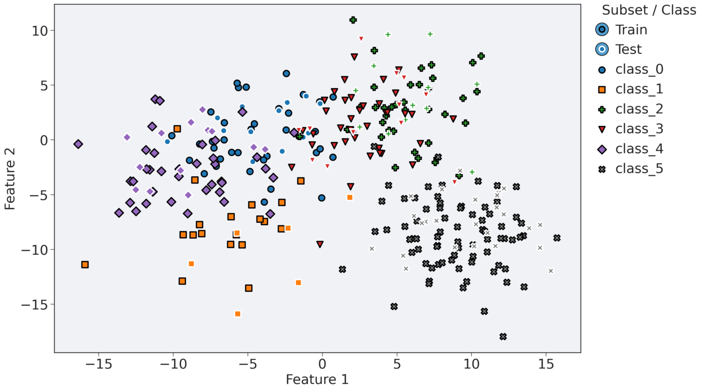
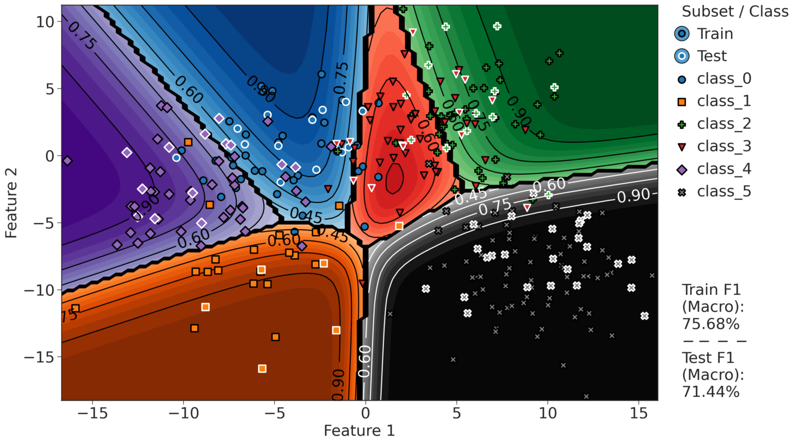
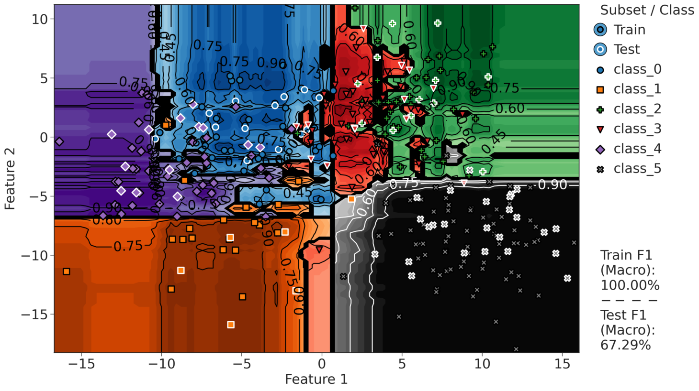

# ProbaViz

**ProbaViz** is a Streamlit app for interactive visualization of class probability scores and decision boundaries of 2D classifiers (primarily from scikit-learn).

The project is inspired by the many visual examples in the [scikit-learn gallery](https://scikit-learn.org/stable/auto_examples/index.html) and by the decision boundary helper utilities presented in a [scikit-learn MOOC](https://www.fun-mooc.fr/en/courses/machine-learning-python-scikit-learn/). While most existing examples focus on binary classification, ProbaViz extends these ideas to **multiclass settings**, enabling visualization of predicted class probability scores for datasets with more than two classes.

The figures below illustrate a synthetic dataset with six classes. The probability contours are produced using classifiers such as `sklearn.linear_model.LogisticRegression` and `sklearn.ensemble.RandomForestClassifier`, trained on two numerical features. Beyond static plots, the underlying visualization logic is designed to support interactivity, allowing users to explore how model hyperparameters affect decision boundaries and common metrics in real time.

  
Example visualizations (multiclass probability surfaces)

## Dataset

## Logistic Regression

## Random Forest Classifier

## 🎯 Project Goals
- Interactive visualization of decision boundaries, probability surfaces and classification metrics
- Support for multiple classifiers on 2D toy and synthetic datasets
- Clear, educational UI suitable for demos and teaching
- Deployable on Streamlit Community Cloud
